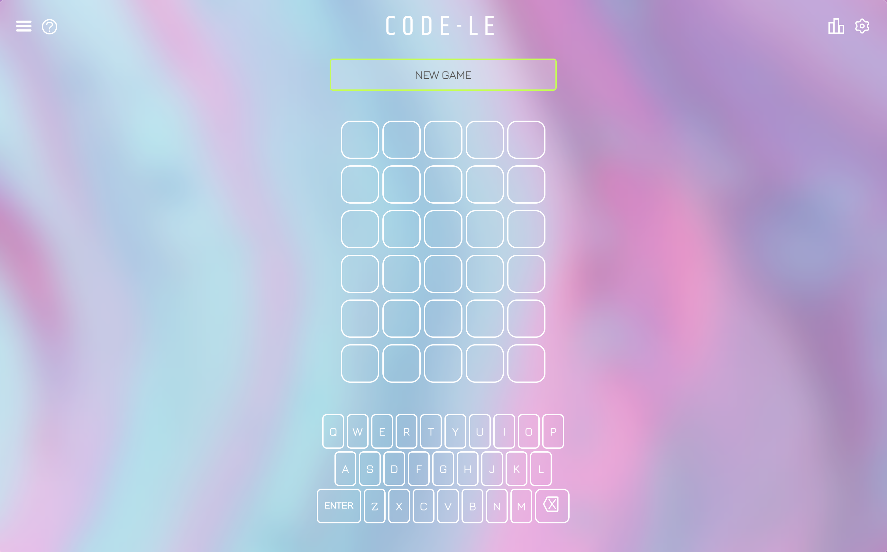

# 👾  CODE-LE 👾 
**Everyone's favorite word game reimagined for software vocab**
___

## Project Description

Code-le is a Wordle clone inspired by Josh Wardle's handiwork. This site: 

- 👾 **Aims to make studying software vocab more fun.** Users can enjoy a fresh take on staring over MDN docs and references.
- 📦 **Stores player data and game state in localStorage.** Leave the game and come back later -- it's all stored in the browser, so no DB necessary. It's a no frills, mostly static site with some plain and simple JS driving the game. 
- 📊 **Tracks progress and visualizes stats** so users can track their learning progress over time. There's a Chart.js React component built into the stats section that pulls data from localStorage to visualize this.



## Develop & Contribute

Want to make Code-le better? Working on it is simple.

### Overview

- 2 Branches: **Master** (default) & **Production**
  - Develop on the **Master** branch
  - **Master** merged into **Production** on significant edits && unit tests pass
- CI/CD Pipeline
  - Continuous Integration (CI) workflow executes on PRs to the master branch via GitHub Actions
  - Continuous Development (CD) executes on merge into production branch (manual review)

### To contribute

- [ ] Fork and clone the **Master** branch
- [ ] Install dependencies in the directory you cloned the repo into
```JavaScript
npm install
```
- [ ] Start a local development server and work your magic ✨✨✨
```JavaScript
npm start
```
- [ ] View code-le in the browser (usually configured to run on [http://localhost:3000](http://localhost:3000))
- [ ] Once ready, open a Pull Request on the **Master** branch with your updates
- [ ] Once submitted, your code will be reviewed and added pending feedback

## Tech Stack
- JavaScript (ES6+)
- React
- Node.js
- Firebase
- HTML/CSS

## Important Links & Docs

- [React Intro Tutorial](https://reactjs.org/tutorial/tutorial.html)
- [Storing A History Of Moves](https://reactjs.org/tutorial/tutorial.html#storing-a-history-of-moves)
- [Introducing JSX](https://reactjs.org/docs/introducing-jsx.html)
- [State & Lifecycle](https://reactjs.org/docs/state-and-lifecycle.html)
- [Function & Class Components](https://reactjs.org/docs/components-and-props.html#function-and-class-components)


## Credits & References
- Wordle by Josh Wardle; current ownership: New York Times
- [Wordle ART Version by Thomas Baudisson](https://dribbble.com/shots/17523579-Wordle-ART-Version)

## Managing Game State


            Can use a 5x5 grid here to keep track of singles.
            Might need a score or something to track repeat characters?

             E  R  R  O  R  i
          A [0, 0, 0, 0, 0] 0  =>  keyStyles[char] = "-incorrect"
          R [0, 1, 1, 0, 1] 1  =>  keyStyles[char] = "-present"
          R [0, 1, 1, 0, 1] 2  =>  keyStyles[char] = "-present"
          A [0, 0, 0, 0, 0] 3  =>  keyStyles[char] = "-incorrect"
          Y [0, 0, 0, 0, 0] 4  =>  keyStyles[char] = "-incorrect"
          j> 0  1  2  3  4  
          
             E  R  R  O  R 
          C [0, 0, 0, 0, 0]    =>  keyStyles[char] = "-incorrect"
          O [0, 0, 0, 1, 0]    =>  keyStyles[char] = "-present"
          N [0, 0, 0, 0, 0]    =>  keyStyles[char] = "-incorrect"
          S [0, 0, 0, 0, 0]    =>  keyStyles[char] = "-incorrect"
          T [0, 0, 0, 0, 0]    =>  keyStyles[char] = "-incorrect"

             E  R  R  O  R 
          A [0, 0, 0, 0, 0]
          R [0, 1, 1, 0, 1]
          R [0, 1, 1, 0, 1]
          0 [0, 0, 0, 1, 0]
          W [0, 0, 0, 0, 0]

            Properties of matrix:
            
            1. Row sum
            The sum of a row is equal to the number of times the attempt character at jth index is present in the answer

            1. Column sum
            Equal to the number of times the ith character of the answer appears in the attempt.

            1. M(i, j) : i = j
            These are the digits at the diagonal of the matrix. Probably the most informative, actually, since this indicates
            both correct presence and position. The diagonal is good to build logic off of.

            For example, if M(i,j) matches condition 3 and the character only appears once then it's correct.